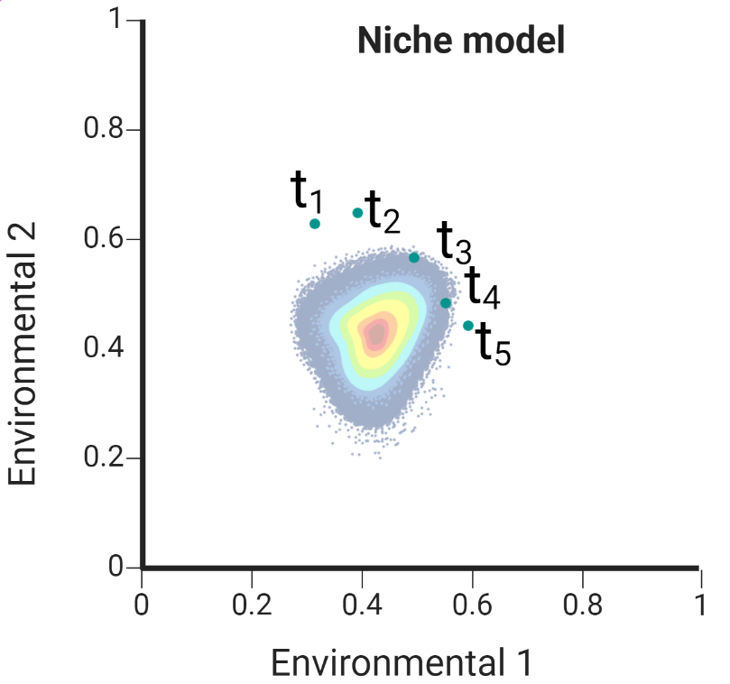
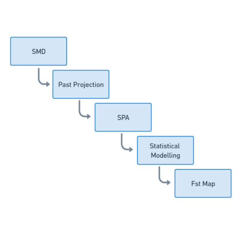
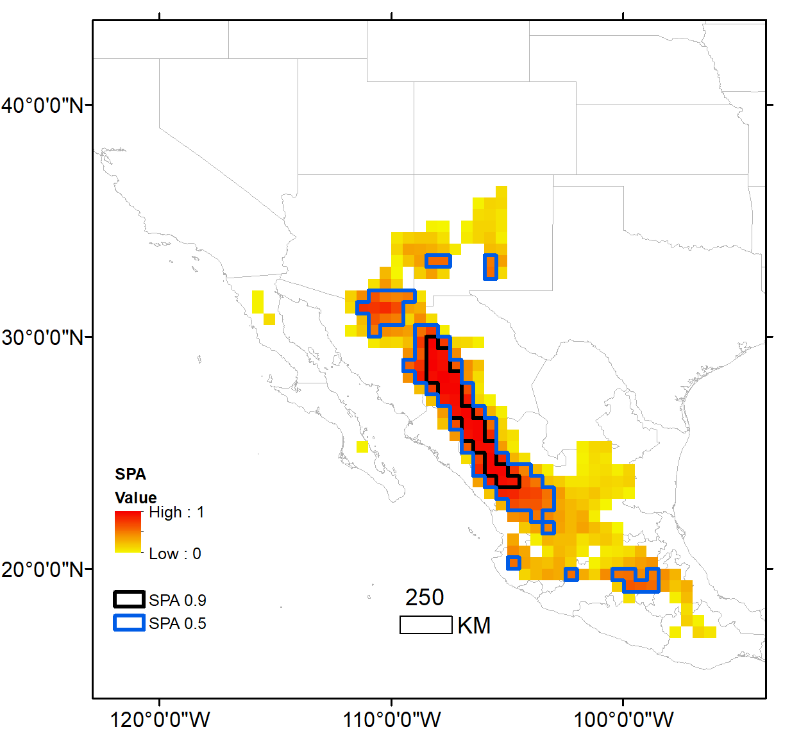
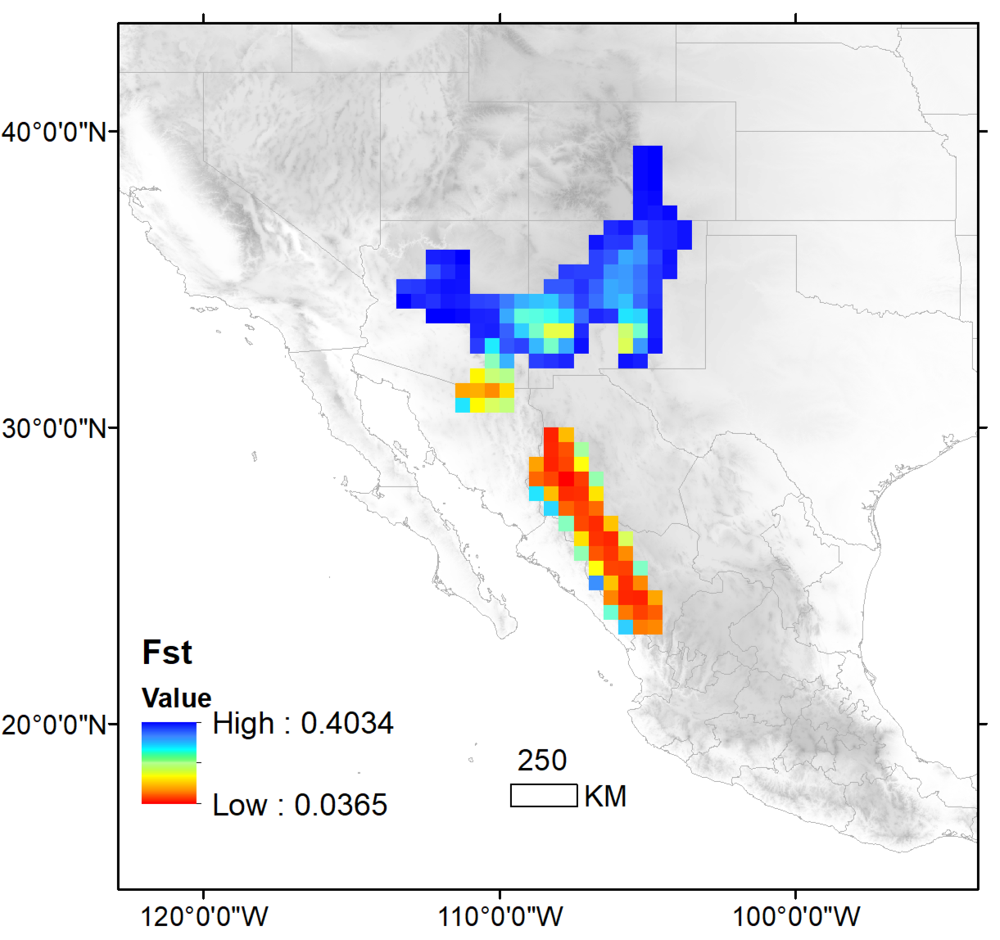

```{r setup, include=FALSE}
knitr::opts_chunk$set(echo = TRUE)
```

## Abstract

Genetic variation among populations is known to exhibit biogeographic patterns in many species, but general rules of spatial genetic variation have not been established. In this paper, we establish a theoretical framework based on projecting environmental Grinellian niches back through time to relate the present geographic distribution of population genetic structure to a given species' historical evolutionary context. 

Thanks to the advance of next-generation sequencing technologies, as well as more accurate climate models and an enormous amount of information stored in biological collections, it is possible to implement this theoretical framework directly. We use as a case study the Tassel-eared Squirrel (*Sciurus aberti*) to jointly analyze spatial, environmental, and genetic data to predict the historical endemic area of this species. Our results reveal that in cases of genetic isolation by geographic distance, the prevalence of environmental suitability over time corresponds to the genetic fixation index of populations with respect to a source population. Populations closer to the historical endemic area present a higher genetic diversity and a lower$F_{st}$ value. 

This empirical example fits into a theoretical framework, which allows us two advances: (i) we can now add a biogeographic explanation to the results obtained with population genetic methods; and (ii) we can generate maps of this genetic structure as predictive tools to support biodiversity conservation efforts. Overall, this work advances a perspective that integrates population genetics with historical patterns of species distribution.

## Introduction

Current species distributions do not always correspond to their
historical distributions over evolutionarily significant periods. Often they differ substantially, such as in the case of postglacial range expansion in high latitude environments (e.g., @lessa2003genetic). This is because environmental conditions are highly dynamic over time, and species
tend to track those environments, distributing where conditions are most favorable. That is, species environmental niches tend to be conserved (@peterson2011ecological).

It follows from this relationship between environment and species distribution that population size also varies with time. This variation in population size is related to the effective population size $N_e$
[@karlin1968rates], so that an index reflecting changes in environmental
conditions in geography might be expected to be related to $N_e$ and thus to indicators of population structure such as the fixation index
$F_{st}$. It should therefore be possible to relate patterns of change in the distribution of species to the genetic structure of their populations using a statistical model that explains this relationship.

With this approach we expect to predict the geographic pattern of population-genetic structure from abiotic environmental information alone. This approach is strongly driven by advances in currently available climate simulations [@leonardi2023pastclim; @krapp2021statistics], as well as next-generation sequencing data, and supported by both ecological niche [@thorup2021response; @nogues2009predicting; @lira2014relationship] and population genetics theories [@lynchi2018]. Importantly, these predicted patterns of population structure will serve as a type of \textit{a priori} hypothesis for the influence of abiotic factors alone, with the empirical detection of deviations from this hypothesis indicating that biotic factors such as competition or predation from other species have also impacted the observed population structure.

In this work, we propose a method to find an index that we call the Suitability Prevalence Area (SPA) that is the area of highest environmental suitability for a given species over a historical time period. The SPA is an index with a double purpose: 1) identifying areas of greatest likelihood for the historical distribution of a target species (i.e., historical endemism); and 2) to explain the expected patterns of genetic diversity given the species' inferred history of population stability and connectivity. 

As a case study, we consider Tassel-eared Squirrels (\textit{Sciurus aberti}), a species of rodent that is currently distributed in disjunct patches from the southern Rocky Mountains in the United States to the northern Sierra Madre Occidental in Mexico for which it is possible to find reliable information on both the genetic structure of its populations and its current distribution [@bono2018genome; @burgin2018many]. To obtain the SPA for \textit{S. aberti}, we overlapped historical reconstructions of the species' geographical distribution estimated every 2,000 years from the present day until 120,000 years ago, recording the environmental suitability in each time interval at each modeled site.

Subsequently, we calculated the fixation index ($F_{st}$) of the genetic relatedness among populations and compared that to the SPA index of historical endemism, constructing a statistical model of the fixation index as a function of the SPA. With this explanatory model, the $F_{st}$ values were projected to the current geographic distribution of \textit{S. aberti} to obtain a predictive map of expected $F_{st}$ values over space.


### Theoretical basis

#### Environment, fitness and suitability

We define \(\vec{e}_i =(e_1, e_2, ..., e_i )\) as a vector of
environmental variables, that is, a point in the space of \(v\)
environmental variables. Then \(R_i(\vec{e}_i)\) is a function that
relates evolutionary fitness to environment. That is, for a species with
non-overlapping generations, the population's net reproductive rate 
\(R_i\) is a measure of evolutionary fitness that depends on
environmental conditions. 

In other words, $\mathbf{G}_o$ is the set of sites in the geography that present positive growth rates related to favorable conditions. If we take the set of places in environmental space where these values are greater than a threshold, we can define a volume in multidimensional space such that $R(\vec{e})$ is always positive and greater than this threshold, that is $\mathbf{N}_F(t) = \{\vec{e} | R_0(\vec{e}(t)) > k \}$.

This is a way of expressing the fundamental niche \(\mathbf{N}_F\) as a function of environmental conditions. Thus, for each site in the geography there will
correspond a site in the environmental space with different
environmental conditions and different growth rates. However, all sites
within the region defined by \(\mathbf{N}_F\) will have viable
populations and positive growth rates. Nonetheless, we assume that the environment is dynamic and each geographic point is static, so for each site in
geographic space this growth rate depends on the environmental conditions and
therefore growth rate changes in value at each time interval.

Locally, the growth rate will be related to the local population
size as long as it is within the boundary defined by \(\mathbf{N}_F\).
Therefore, the local population size as a function of the intrinsic growth rate, which depends on the change in environmental conditions over time, can be expressed as:
\(N_i(t+1) = R(\vec{e_i}(t) ) N_i(t)\). That is, the locally population size is a function of ideal environmental conditions.


We start by considering this defined volume of the set of \(R_0\) as a
set of trajectories for each point from geographic space to
environmental space. Considering this rate fixed \(\mathbf{R}_0\) when
the population grows, that is,
\(\mathbf{N}_F(t) = \{\vec{e} | R(\vec{e}(t)) > 1 \}\) and therefore
any local population will have a positive growth rate.

{width=50%}


This equation was proposed by Soberon and Peterson [-@soberon2020shape] to relate demographics to a function of evolutionary fitness and environment. In that study they tested the validity with monthly variables and empirical values on a short time scale. relating life history parameters and the environmental suitability of niche models.


This set can be seen as a convex volume in environmental space and we
relate this growth rate to an environmental suitability function bounded
between \(0\) and \(1\), for example, for a unimodal multivariate probability density function,
it would be equivalent to the distance from the maximum of the function.
That is, the fitness-related environmental suitability can be any
function such that it is \(0\) if \(R_i(\vec{e}_i) > 1\) and \(1\) when
\(R\) is evaluated at the expected value of \(\vec {e}\) for all values
of \(R_i(\vec{e}_i) > 1\). In a practical way, \(\mathbf{N}_F\) is
approximated from points of presence in the geography obtained from
databases, numerically approximating a convex surface with a surface
\(\mathbf{N}_R\) of the environmental space.


Once we have an approximation of this volume, we consider that each
point in the geography is static and has a trajectory in the
environmental space and that for each trajectory, the fitness function
changes and, therefore, the suitability function changes but not
accordingly, in a homogeneous way, if not more so that each site
presents different displacement rates and different demographic rates.

The goal of this theoretical approach is not to know the shape of the function of $R$ but rather to find this local variation relating this value of $R$ and the function $\mathbf{N}_F$ with a function $ S_i(\ vec{e}_i)$ of environmental suitability that can be estimated from known methods of applied mathematics and machine learning (for example the case of Maxent, [@phillips2006maximum]), i.e. :

$$
N_i \propto  S_i(\vec{e}_i)
$$
Population size locally is a function of environmental suitability, where if suitability is $0$ the population is $0$ and if suitability is $1$ the population has a maximum growth rate $R_i(\vec{e}_i)$ in some point of the environmental space.

#### Genetic variation and effective population size

On the other hand, loss of heterozygosity may be related to the amount of genetic variation present in the absence of mutation and selection, so theoretically, one would expect a strong correlation between effective population size and heterozygosity on the basis of population genetics. We start from the assumption that in the absence of gene flow between subpopulations, the rate of fixation by isolation depends on the effective population size $N_e$ when subpopulations diverge from a common ancestor in $t$ generations. [@hedrick2005standardized: @wright1943isolation, @lynchi2018]:

$$
F_{st}(t) = 1 - e^{-kt/N_e } 
$$

where we assume, according to Nei [@nei1986definition], that genetic drift within each subpopulation causes the average heterozygosity between populations ($H_s$) to approach zero ($F_{st} = 1 - H_s/H_t$), i.e., for $t=0$ $F_{st} = 0$ and for very large $t$ the index is $1$.
that is, for $t=0$ $F_{st} = 0$ and for very large $t$ the index is $1$. We have included a constant $k$ without loss of generalization.  

Using $e(x) = \sum_{k=0}^{\infty} \frac{x^k}{k!} = 1 + x + \frac{x^2}{2} + ...$ and leaving to first order for $N_e$ large enough

$$
F_{st} \approx \frac{kt}{N_e} + C
$$

Moreover, the effective population can be estimated as the harmonic mean of the population in a demographic time series [@karlin1968rates] for $\tau$ generations $\frac{1}{N_e} \approx \frac{1}{\tau}\Big({\frac{1}{N_1} + \frac{1}{N_2} + ... + \frac{1}{N_\tau} } \Big)$. We substitute the harmonic mean into the above equation, considering that although the number of generations is not exactly equal to the time of the fixation index, they are expected to be very close:

$$
F_{st} \approx \Big (kt\Big)  \frac{1}{\tau}\sum_{j=1}^{\tau}\frac{1}{N_j} 
$$

#### Relationship between the fixation index and environmental suitability
We can infer locally for each population $N_i$ in the geography expect to be proportional to the environmental suitability for each time considered, 
For simplification in the index we select a $N_i$ population in the geography and infer that locally, this population is proportional to the environmental suitability in each time considered, i. e. $N_{j} \propto S_{j}(\vec{e}_{j})$  (each index $j$ is for the generation time), as we describe above, so we can asume an harmonic mean of suitabilities $\frac{1}{\tau}\sum_{j = 1}^{\tau} \frac{1}{S_j}  = \frac{1}{S}$ and substitue in the previous equation:


$$
F_{st} \approx \Big (kt\Big)  \frac{1}{\tau}\sum_{j=1}^{\tau}\frac{1}{S_j(\vec{e_j})}
$$

We call this harmonic mean of environmental suitability *Suitability prevalence index *($S$) given between $0$ and $1$, since it reflects the rate of population growth as a function of environment over a period of time. Thus we have a way to check that the loss of heterozygosity (through the fixation index $F_{st}$) is inversely proportional to the suitability prevalence for an $i$ site in the geography:


$$
F_{i}^{st}= \frac{\beta_0}{S_i} + \beta_1
$$
If we consider all sites in the available geography, we call this
harmonic mean \emph{Suitability Prevalence Area}
\(\mathbf{S} = \{S_i | S_i > k\}\) (SPA) since we expect that areas
where the \(F_{st}\) is lower are in areas where the prevalence over
time is higher, i.e.~environmental conditions remain suitable for a
significant period of time and therefore no effects of genetic drift of
populations have occurred. Conversely, it is expected that in
populations with a high fixation index value, suitability will not have
prevailed over the same time interval even though conditions currently
exist and populations are present.

## Methods

We summarize our 5 steps predictive approach in the figure 2.

<p align="center">
{width=30%}
</p>

We propose a method to find the Suitability Prevalence Area (SPA) as an index with a dual purpose: 1) to find endemic areas to delimit the historical distribution of species and 2) to explain patterns of genetic diversity.  

The method for estimating SPA consists of a series of 4 steps:

1. Model the potential distribution of a taxon with present-day environmental conditions and obtain an environmental suitability map.
2. Project the potential distribution model to various environmental scenarios in the past with constant time steps and obtain the environmental suitability for each time scenario.
3. Characterize past analogous climates and retain projections only for sites with climates analogous to the present.
4. Generate a harmonic mean suitability map for all time slices.

Subsequently, one application of the SPA is to explain genetic diversity (the fixation index) as a function of the SPA and project it to the geography. For this it is necessary to perform a series of steps, which consist of:

- Obtain georeferenced points of genetically structured populations with fixation index values.
- Extract values from the SPA map with these points. 
- Perform a linear model of the fixation index value with respect to the SPA.
- With the linear model all SPA values of suitability are interpolated.
- Generate a map with all the values interpolated by the model.

As a case study we consider squirrels (*Sciurus aberti*), a species currently distributed in disjunct patches from the southern Rocky Mountains in the United States to the northern Sierra Madre Occidental in Mexico for which it is possible to find reliable information on both the genetic structure of its populations and its current distribution [@bono2018genome; @burgin2018many]. In order to select this species, we list the following considerations: 

As a case study, we consider squirrels (\emph{Sciurus aberti}), a species
currently distributed in disjunct patches from the southern Rocky
Mountains in the United States to the northern Sierra Madre Occidental
in Mexico for which it is possible to find reliable information on both
the genetic structure of its populations and its current distribution
[@bono2018genome; @burgin2018many]. In order to select this species,
we list the following considerations:

- Since it is a medium-sized mammal (0.5 kg) its identification is easy.
- The subspecies are geographically isolated, since they are found in pine forests surrounded by desert. Therefore we can consider the assumption of isolation by distance [@wright1943isolation]. 
- It has low speciation rate (0.25) [@upham2019inferring], therefore, we assume that its fundamental niche is stable over time.
- There is fixation index information [@bono2018genome] for different populations of the subspecies, which is useful for using SPA as a way to explain genetic differentiation between populations.

### Unique occurrence records 
We have downloaded geographic information on Sciurus aberti from the open access platform Global Biodiversity Information Facility (GBIF). Subsequently, we eliminated duplicate records, those without precise coordinates and those with uncorroborated collection information. Once the unique occurrence records were obtained, we filtered the geographic space in order to avoid overpredictions in the spatial distribution models caused by the agglomeration of occurrence points. The filtering consisted of superimposing the records in the geographic space, then we made 5 latitudinal slices of 5 degrees of separation between each one, from latitude 20 degrees south to latitude 45 degrees north, taking as criteria the known distribution of the species and the ecoregions of North America, level 1 (downloaded from the US Environmental Protection Agency, 2010). Once the geographic space was segmented, we left the same number of records for each band (30 records per band) obtaining a total of 150 unique records of presence.

### Environmental characterization
The environmental information to generate the models, from the present and the reconstruction to the past, was obtained from Pastclim 1.2, an R statistical software package designed to download and manipulate paleoclimatic datasets. In our particular case we chose the Beyer at al. @beyer2020high set as it has environmental information available up to 120 000 BE, significantly evolutionary time, at 2000 year time intervals based on Global Circulation Models HadCM3 [@singarayer2010high] and HadAM3H [@valdes2017bridge].  The environmental dataset has 17 bias-corrected bioclimatic variables, reduced spatial scale and spatial resolution of 0.5°square cells.  

### Accessibility region ($\textbf{M}$).
Species distribution models according to the BAM diagram [@soberon2005interpretation] states that the geographic range occupied by a species ($\textbf{G}_o$) is the region of appropriate assemblages in terms of abiotic conditions. The region $\textbf{M}$ represents in geography areas in which the species has access due to its colonization capabilities and the structure of geographic barriers within a specific period of time [@soberon2009niches].

In this study we selected a set of North American ecoregions for modeling to delimit our Accessibility region. We took into account ecoregions that overlap with the known distribution of the species and also took into account neighboring ecoregions to increase the potential accessibility in projection scenarios to the past. Thus, regions 5, 6, 9, 10, 12, 13 of the level I ecoregions (<https://www.epa.gov/>) were selected.

### Niche models 
#### Current distribution
Estimating niche boundaries for species occurrence is called ecological niche modeling (ENM), and when the emphasis is on geographic distribution, it is known as species distribution modeling (SDM) [@guisan2005predicting; @peterson2012species; @saupe2012variation]. We model the current distribution of S. aberti using the MAXENT 3.4.4 algorithm [@phillips2006maximum], which is a correlative model based on the maximum entropy principle used to estimate species distributions. The output of Maxent is a relative occurrence rate (ROR) interpreted as a probability of habitat suitability given observed environmental conditions by presence-only points [@merow2013practical]. 

The parameterization was performed with the default values of the program with the exception of the "extrapolate" and "clamping" options to avoid artificial extrapolations in the extreme values of the climatic variables used in the models. To calibrate the models we used 70% of the records and the remaining 30% to validate them. 

In order to give statistical certainty and to consider uncertainty, as well as to reduce overfitting and to have a suitable model to extrapolate to past scenarios, 10 replications were performed for each model using a cross-validation with the training data. In the end, the average model of these replications was considered as the result.

We evaluated the statistical significance of the resulting models for the present using the partial ROC test [@peterson2008rethinking], which is a modification of the ROC (receiver Operation Characteristic) test. The results of this test are proportions (ratios) of the area under the curve of the model with respect to a null model, product of repetitions that allow to statistically evaluate the areas under the curve (AUC) in relation to that expected by chance [@peterson2008rethinking], where a value derived by chance would be $0$ and an acceptable value, according to the proportion of minimum omission errors tolerated in the model, would be greater than $1$. A different set of test data was used on the average model of the replicates and in this way the reduction of overfitting was guaranteed.

#### Reconstruction to the past
The average model obtained from Maxent was extrapolated to environmental conditions into the past. Environmental layers were taken from pastclim [@leonardi2023pastclim] in 2000 year time slices to cover a total of 120 000 years. For each scenario into the past, 10 replicates were cross-validated and averaged. For each projection into the past, as well as the model of the present, we generated a binary map at a suitability threshold of 90\% to get an estimate of the area distribution for each time slice in pixels. In addition we fit a locally estimated scatterplot smoothing (loess) model to the time series trend area using the R package stats in order to observe patterns in the area - timeline scatterplot. 


### Suitability Prevalence Area (SPA)
Finally, to generate the SPA, both the average projection of the present and all the average projections of the past are considered. The output files are read in raster format.

A harmonic mean is performed as follows:
For each layer the inverse of each cell value is obtained. Then the inverse values are summed by cells and divided by the number of scenarios. Finally, the inverse of each cell is obtained. It is important to consider that the Maxent outputs may contain very small values close to zero in many cells, for this reason we added a small amount of $0.001$ to all the values in all the maps so that when obtaining the harmonic mean we could have an inverse value for values close to zero without altering the biological sense of environmental suitability.

### Endemic historic Area
To calculate the historic endemic area, the SPA result is taken and a threshold is applied to generate a binary map according to the $mathbf{S}$ equation. This threshold is the proportion of time that pixel has had ideal conditions. For our study, we consider the value of 90\% since for a period of 120 000 years it is a coverage of 100 000 years, which is a significantly evolutionary time to fix genetic patterns at the population level.

### Fixation index as a function of SPA

To test our hypothesis of genetic diversity as a function of environmental suitability prevalence, from a set of genetically structured populations, a matrix of fixation indices between populations is considered. For this work we considerer the data from @bono2018genome. It consideres 10 populations along the known distribution and provides values of $F_st$ between this populations in matrix form. The matrix was transformed into a table as pairs between populations with index values between each pair. The values of the population with itself, i.e. $0$, were included. Subsequently, georeferences were obtained for each population considered in the fixation index matrix. From this geo-referencing the SPA value for each population was extracted. Finally, the SPA value was aligned in the table of fixation index pairs. In total the table has 4 columns: source population, target population, fixation index and SPA of the target population. This table was separated by source population groups to generate a set of linear models between SPA values and fixation indexes $F_{st}$. An analysis was performed for each source population with the hypothesis that the correlation between SPA and fixation index exists and is non-zero if a dispersal process has occurred from the historical endemic area of the taxon.  

### Fixation index projected in geography
The linear model that presents the highest value of $R^2$ is considered suitable to make a geographic projection of the fixation index and observe genetic diversity in geographic space.  To generate this map, the SPA values are taken and a table of coordinates and SPA values is generated for each cell of the raster. The SPA values are then extrapolated to obtain fixation index values from the linear model obtained previously. This column is added to the coordinate table and a raster is generated with the projected $F_{st}$ values. Finally, a cutoff of this raster is performed using a map of the distribution of the species at present with a cutoff threshold of 90% in binary format (where $1 =$presence and $0 =$ absence), since the records of the presence localities were obtained from bases that might contain some errors in the data [@phillips2006maximum].  


## Results

### Current and past distribution
We get the binary maps for all the models in suitability threshold of 0.9 and extract the number of pixels above this threshold in order to get a relative predicted area. Here we show the trend from present (Figure 3A) to past of the the projected area of *Sciurus aberti* along the time line (Figure 3F). The trend pattern exhibits an inverted U-shape, showing that the present area is similar to the 120 000 area, with a maximum in 22 000 coinciding with the Last Glacial Maximum in North America (Figure 3B). We highlight three other notable scenarios, the first local minimum after the interglacial maximum appears in the year 30 000 (Figure 3C) coinciding with a distribution similar to the present but with more suitable regions emerging in New Mexico and Colorado; a local maximum in year 62 000 at the middle of the trend line (Figure 3D), with a more suitable potential distribution towards the south, with conditions disappearing practically everywhere in the United States, except in the border with Sonora, but connecting the area of the Sierra Madre Occidental with Zacatecas, San Luis Potosí and the appearance of a corridor over the Transverse Volcanic Axis (from Jalisco to Tlaxcala); finally we show a minimum area of the whole time series in year 112 000. (Figure 3E), with the disappearance of conditions in practically all the places where there were expansions, preserving conditions only in some places of Chihuahua (Campo Verde and Tutuaca Natural Protected Areas), Durango and Arizona (Prescott and Sedona).


<p align="center">
![A) Species distribution model for *Sciurus aberti* present distribution. B) Relative projected area for SDM in pixels acoording a threshold of 0.9 suitability for each past time-sliced environmental conditions. We can observe a maximum area corresponding to the last interglacial era and an inverted U-shape in the trend of the area along the time considered. Also It can be noted that the actual distribution has similar area to the coditions 120 000 years ago. B) and D) corresponds to distribution peaks along the time scale and C) and E) corresponds to minimum  ](all_figures/figure_3.png){width=100%}
</p>

### SPA and Endemic Historic Area
We get the suitability prevalence area delimited by a 0.5 and 0.9 threshold (Figure 4). The endemic region where the enviornmental conditions 90 \% of the time is the Sierra Madre Occidental, in the limits of Sonora, Chihuahua, Sinaloa and Durango. We correspond this Area to the *Sciurus aberti barbieri* subspecies. Also
is notable that at 0.5 threshold, other regions seems to have stable conditions. We observe the area close to Coronado National Forest as well as Gila National Forest and Mescalero Reservation as suitable areas along time in the United States and some Areas of the Volcanic Belt in Mexico (Puebla, north of Guerrero State and Jalisco.  
<p align="center">
{}
</p>

### $F_{st}$ as a funciton of SPA and Fixation index projected in geography

For all the linear regressions performed (Table 1), the only one that had statistical significance is the one for the Sciurus aberti barberi population with an $R^2$ value of $0.794$. 

|          Population          | R squared | p value |
|:----------------------------:|:---------:|:-------:|
|   _S. a. aberti Carson-SFW_  |     0     |  0.962  |
| _S. a. aberti Coconino-Gila_ |   0.131   |  0.304  |
|    _S. a. aberti MT-Zuni_    |   0.002   |  0.894  |
|    _S. a. aberti San Juan_   |     0     |  0.952  |
|        _S. a. barberi_       |   0.794   |  0.001  |
|     _S. a. chuscensis E_     |   0.002   |  0.892  |
|     _S. a. chuscensis W_     |   0.018   |  0.713  |
|   _S. a. ferreus Carson E_   |    0.04   |  0.581  |
|     _S. a. ferreus Pike_     |     0     |  0.967  |
|      _S. a. kaibabensis_     |   0.005   |  0.841  |

It can be noted that S. a. aberti Coconino-Gila had an R-squared value greater than 0 (0.131) but it is not statistically significant. Furthermore, in our approach we imputed the value of the origin with an Fst of zero. To show that the model hypothesis still holds, we performed a regression for barberi without the point of origin imposed (Figure 5b), in addition to eliminating the S. aberti chuscensis populations due to their low uncertainty in georeference, obtaining an R-squared of 0.72 (p value = 0.016). 


```{r, figures-side, fig.show="hold", out.width="50%",  fig.cap="Linear regression for S a. barberi population A) SPA in all populations B) withouth barberi and chusensis populations. We can observe that in both cases the fixation index is explained with the SPA and the hypothesis holds without the imputation of the origin of the population (this means to add a 0 $F_{st}$ value for barberi population)", echo=FALSE}


knitr::include_graphics(c("all_figures/figure_5a.png","all_figures/figure_5b.png"))
```

 
From the model we extrapolated the values from SPA along the geography to new $F_{st}$ values to get a geographical projection of fixation index from *S. a. barberi* population. (Figure 6). The lowest values are close to the Sierra Madre Occidental Area, in the limits of Chihuahua and Sonora States as well as Sinaloa and Durango, score higher near to the Tutuaca Wildlife regue There is also a hotspot between Sonora And arizona, near to Bisbee Arizona in United States as well as Naco Sonora y Mexico.  
   

<p align="center">
{width=80%}
</p>

## Discussion

With the current availability of occurrence data and models of potential
distribution projected to past climate scenarios it is possible to find
geographic patterns of differentiation in populations at an acceptable
resolution (half a degree) that allows us to define sites where the
species can potentially be found but share different degrees of genetic
diversity.. 

Projections of genetic diversity in geography have been made in previous
studies [@van2012mapping]. However in a general way they are
extrapolations of observations, without a predictive model, which with
some explanatory variable behind can explain in a statistically
convincing way the information obtained from population genetics.

We have shown a generalizable protocol for predicting patterns of
population genetics in geography. In this way we link information on the
evolutionary history of a taxon and its ecology. In addition, we provide
a predictive vehicle that generates new geographic information
applicable to decision making in both survey conduct and taxon
conservation.


Thanks to the theoretical support that we have briefly outlined in this
paper, it is possible to explain the explanatory value of the
coefficient of determination for our linear model, $R^{2} = 0.79$,
which is information coming from two completely different sources, but always guided by the premise of the evolutionary process as causal.

These maps represent a turning point in the conception of conservation.
With the tool we propose in this study, it is possible to delimit
conservation sites based on evidence of current and historical
distribution and genetic diversity among different populations.

While many conservation decisions are made on the basis of genetic
diversity, studying the genetic structure of populations at a
macro-scale is often very complicated, and making conservation decisions
based on current distribution without taking into account the historical
distribution of taxa can lead to a misguided conservation strategy.

The generalization of our protocol and its implementation in tools
widely used by biogeography allow its direct implementation in many case
studies with available information, as well as the design of new
questions, e.g.~species assemblages under prevalence of environmental
suitability. A research path was also established on whether the process
of environmental stability over time is related to biodiversity.

It is also noteworthy to mention that in previous taxonomic descriptions, it was taken into account that the distribution of Sciurus aberti was only related to the distribution of Arizona pinus ponderosa. However, there is a consensus on the range of distribution of this pine, which is limited to the southern United States [@hess2020mexican]. Therefore the known distribution of Sciurus aberti is in mixed coniferous forests. This plasticity in the squirrel-pine interaction explains the expansion of the species in interglacial periods and its distribution in warmer periods, such as the current one. However, the low genetic diversity found in places where the squirrel species interact with few pine species could put it at greater risk of climate change that constricts the distribution of p. p. Arizona, especially in the Sky Island region of Arizona.

### References
